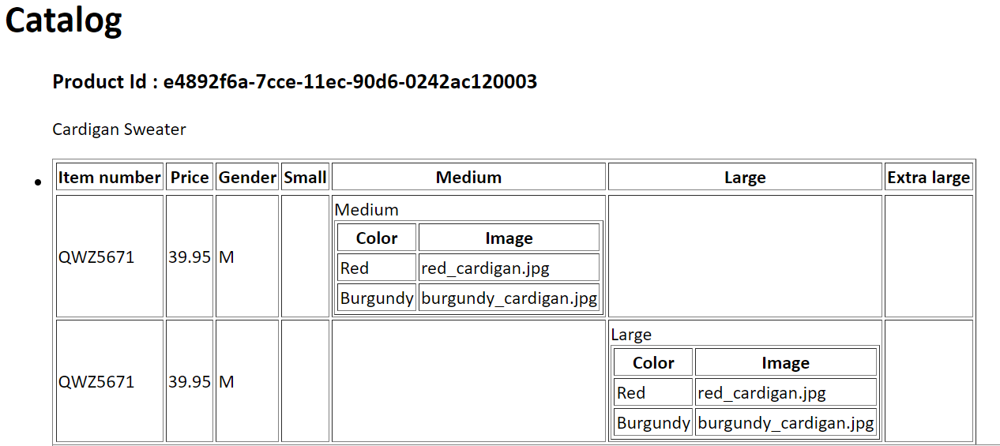

1. 
   

- Style sheets are expressed using the XSL language. A.xsl files are a bit the same with .css files that most HTML documents use and there are a lot of applications used to open these files since this format supports almost all sheets in XML styles. 
